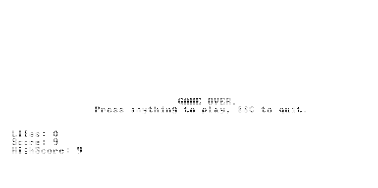

# Nand2Tetris-Project-09
From NAND to tetris course, project 09 (A jack game).
Nand2Tetris website: http://nand2tetris.org/

## Description
A challenging and addictive single player shooting game.
The more you score, the more difficult it becomes. Will you beat your own high score?

## Usage
Download the software package from nand2tetris (https://www.nand2tetris.org/software)
Also download all the files from as_vm, to a single directory of your choice. Then, in the VMEmulator, choose to open files, and select the entire directory where the .vm reside. Finally, switch 'Animate' to 'No Animation' and click run.

## How to play
The game is simple: The goal is to score as many points as you can. In each game cycle you have five lives.
Each miss reduces your life-count by one. Every score awards you with a point.
Use the space bar to throw the ball, and ESC to quit.

Note: Currently the highest score you can achieve is 9 points.
My best score is 8, can you beat my record?

## Demo of game
https://www.youtube.com/

(Currently unavailable)

## Images of the game
The basket is moving

<kbd></kbd>

And you need to shoot on time to score

<kbd></kbd>

If you miss, the game might be over...
  
<kbd></kbd>

Will you be able to stop? 

<kbd></kbd>
