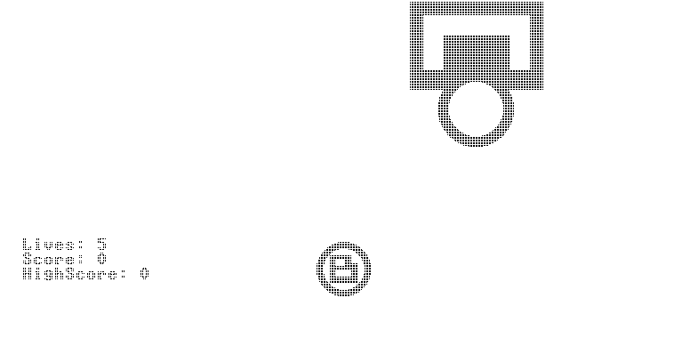
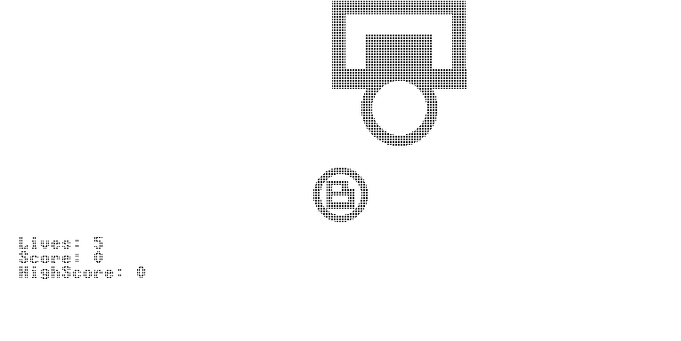
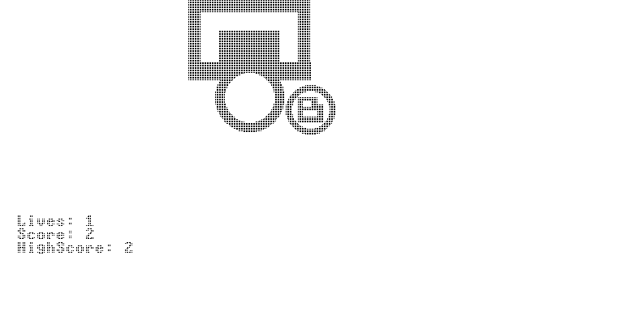
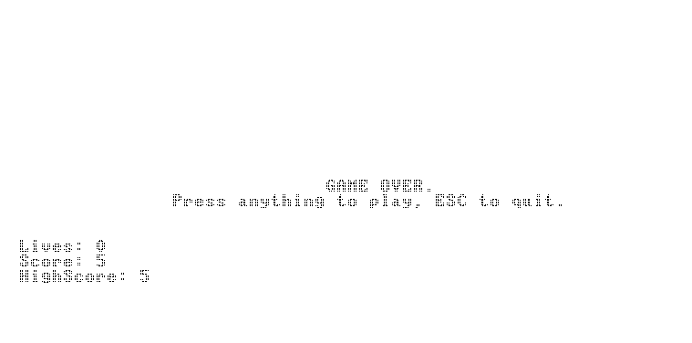

# Nand2Tetris-Project-09
From NAND to tetris course, project 09 (A jack game).
Nand2Tetris website: http://nand2tetris.org/

## Description
A challenging, and addictive, shooting game basketball shots.
As much as you score, the harder it becomes, can you beat your own high score?

## Usage
Download the software package from nand2tetris (https://www.nand2tetris.org/software)
Also download all the files from as_vm, to a single directory of your choice. Then, in the VMEmulator, choose to open files, and select the entire directory where the .vm reside. Finally, switch 'Animate' to 'No Animation' and click run.

## How to Play
The game is very simple; you have to score as mush as you can.
In each game cycle you have five lives, while each miss reduces your lives by one; every score awards you with a point.
Use the space bar to throw the ball, and ESC to quit.

Note: currently the highest score you can achieve is 9; can you beat that score?
My best try was 8, so let me know if you break the score.

## Demo of game
https://www.youtube.com/
(Currently unavailable)

## Images of the game
The basket is moving,

<kbd></kbd>

And you need to shot in time to score,
  
<kbd></kbd>

Cause if you miss, the game might be over...
  
<kbd></kbd>

Will you be able to stop? 

<kbd></kbd>
